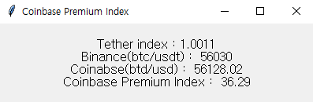
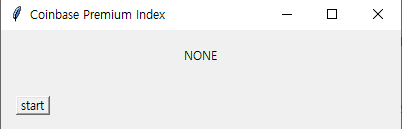

# Coinbase_Premium_Index

 CPI concept made by [CryptoQuant](https://cryptoquant.com/prochart/fdxeih58iv)

 What means the Coinbase Premium Index(CPI)?    
 It shows difference between BTC/USD(in Coinbase pro) and BTC/USDT(in Binance).     
 
 CPI = (Coinbase Price) - (Binance Price) * (Tether Index)     
 CPI = BTC/USD - BTC/USDT * USDT/USD     
 
 
 
 By checking CPI, we could predict that whale in US and Wall street sell or buy.    
 If CPI > (Constant) > 0 then, they bought.    
 If CPI < (Constant) < 0 then, they sold.    
 Acutally, I don't know size of Constant. I think... Constant > 50.      
 
 Recently, when BTC was 52 -> 54K, I saw CPI > 50. 
 Next day, BTC go 56K.    
 
 
 I use threading, tkinter, ccxt, time, tradingview_ta, cbpro module.
 I try to construct thread...
 
 
 ## Instruction
 1. Download CPI.py
 2. Install moudle
 <pre>
  pip install cbpro
  pip install ccxt
  pip install tradingview_ta
 </pre>
 3. execute by IDE or make .exe     
 4. click start     
 

 Thanks
 
